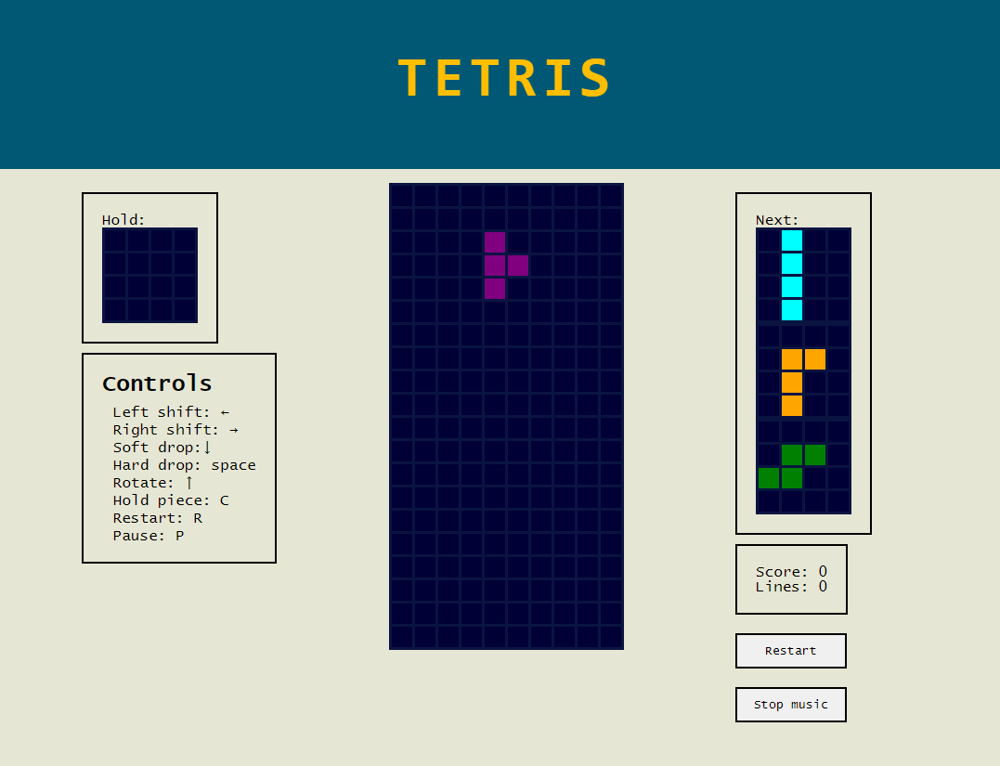

# TETRIS

Created only using Html, css and Javascript. The implementation follows as much as possible official Tetris [guidelines](https://tetris.fandom.com/wiki/Tetris_Guideline).

### Play [here](http://web.studenti.math.pmf.unizg.hr/~gorivan/)!

## How to play

Stack your pieces as long as you can and don't make them stack to the top of your screen!
When you fill up the line, it empties out.

### Controlls:

Left shift: ←

Right shift: →

Soft drop:↓

Hard drop: space

Rotate: ↑

Hold piece: C

Restart: R

Pause: P

## Screenshots

